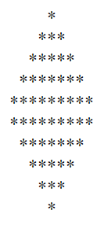
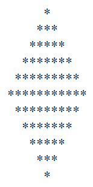

# TASK 2 - DIAMOND SHAPE USING RECURSION

Link: https://giedrebi.github.io/TASK2_DIAMOND/

### About task 

* Task was to made diamond shape using recursion (no loops). 

* If entering an even number should not display the middle row:

`var n = 10;` :

* If entering an odd number should display the middle row as well: 

`var n = 11;` :

* For this task I was using HTML and Javascript.

### Launch procedure
1. Go to the folder where you want clone repository, then open GIT BASH/ terminal there.

2. Type the bellow line and press Enter to create your local clone:

`$ git clone https://github.com/giedrebi/TASK2_DIAMOND.git`

3. Open cloned project folder in VScode. To see website, press on Go Live in the bottom line.

### Author

This mini project was created by me [Giedre Bielske](https://giedrebi.github.io/)

As well, you can find me in [LinkedIn](https://www.linkedin.com/in/giedr%C4%97-bielsk%C4%97-1a8996107/)